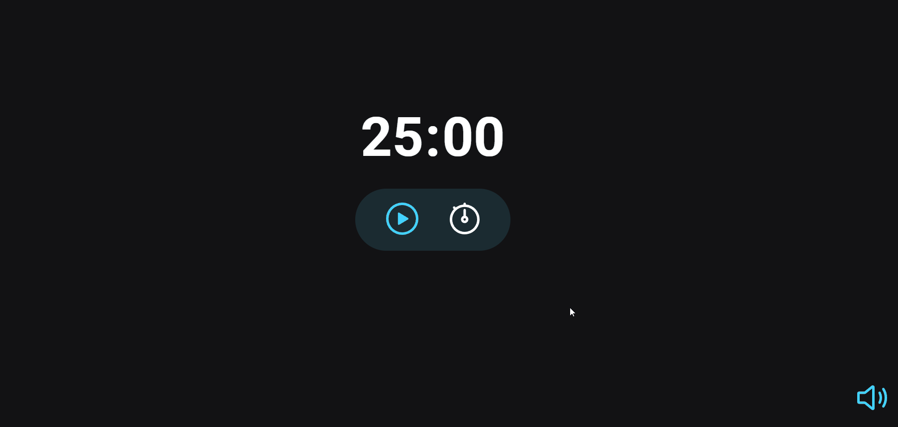

# Focus-Timer
Projeto de um cronômetro interativo com sons e interatividade com o usuário.
 
Para esse projeto foi utilizado:

- ES6 Modules
- Padrão Factory
- DOM 
- Injeção de dependências

## Video do projeto por dentro

